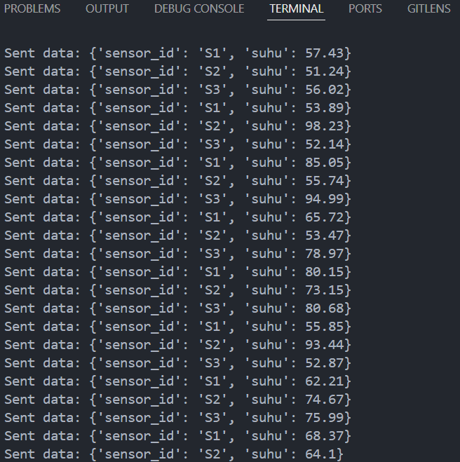
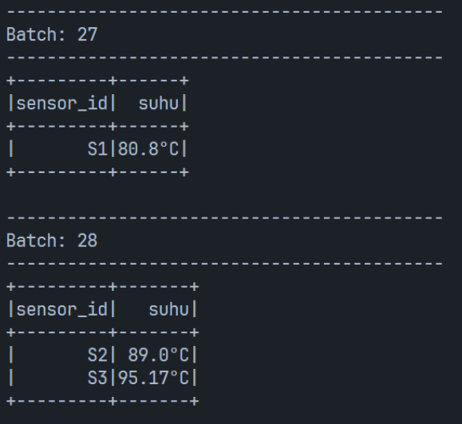

| Nama                    | NRP        |
| ----------------------- | ---------- |
| Muhammad Arsy Athallah   | 5027221048 |
| Nur Azka Rahadiansyah | 5027221064 |

# **Studi Kasus Apache Kafka**
**Topik:** Pengumpulan Data Sensor IoT dengan Apache Kafka

**Latar Belakang Masalah:**
Sebuah pabrik memiliki beberapa mesin yang dilengkapi sensor suhu. Data suhu dari setiap mesin perlu dipantau secara real-time untuk menghindari overheating. Setiap sensor akan mengirimkan data suhu setiap detik, dan pabrik membutuhkan sistem yang dapat mengumpulkan, menyimpan, dan menganalisis data suhu ini.

**Studi Kasus Sederhana:**
Pabrik membutuhkan aliran data sensor yang dapat diteruskan ke layanan analitik atau dashboard secara langsung.
Apache Kafka akan digunakan untuk menerima dan mengalirkan data suhu, sementara PySpark akan digunakan untuk mengolah dan memfilter data tersebut.

**Tugas:**
Buat Topik Kafka untuk Data Suhu:

Buat topik di Apache Kafka bernama "sensor-suhu" yang akan menerima data suhu dari sensor-sensor mesin.
Simulasikan Data Suhu dengan Producer:

Buat producer sederhana yang mensimulasikan data suhu dari beberapa sensor mesin (misalnya, 3 sensor berbeda).
Setiap data suhu berisi ID sensor dan suhu saat ini (misalnya, sensor_id: S1, suhu: 70°C), dan dikirim setiap detik ke topik "sensor-suhu".
Konsumsi dan Olah Data dengan PySpark:

Buat consumer di PySpark yang membaca data dari topik "sensor-suhu".
Filter data suhu yang berada di atas 80°C, sebagai indikator suhu yang perlu diperhatikan.
Output dan Analisis:

Cetak data yang suhu-nya melebihi 80°C sebagai tanda peringatan sederhana di console.
Hasil yang Diharapkan:
Mahasiswa diharapkan dapat:

Mengerti dasar cara kerja Kafka dalam menangani data stream dari sensor.
Membuat producer dan consumer sederhana.
Melakukan pengolahan data dasar di PySpark dengan mengkonsumsi data dari Kafka.

**yaml**

```yml
services:
  zookeeper:
    image: "bitnami/zookeeper:latest"
    container_name: zookeeper
    environment:
      - ALLOW_ANONYMOUS_LOGIN=yes
    ports:
      - "2181:2181"

  kafka:
    image: "bitnami/kafka:latest"
    container_name: kafka
    environment:
      - KAFKA_BROKER_ID=1
      - KAFKA_ZOOKEEPER_CONNECT=zookeeper:2181
      - ALLOW_PLAINTEXT_LISTENER=yes
      - KAFKA_LISTENERS=PLAINTEXT://:9092
      - KAFKA_ADVERTISED_LISTENERS=PLAINTEXT://localhost:9092
    ports:
      - "9092:9092"
    depends_on:
      - zookeeper
```
Step pertama gunakan Command `docker-compose up -d`

Setelah Docker container berhasil dibuat kita akan membuat topic kafka nya dengan menggunakan command berikut

```bash
docker exec -it kafka bash
```
Setelah kita berhasil masuk ke dalam container kafka maka jalankan command berikut untuk membuat topic

```bash
kafka-topics.sh --create --topic sensor-suhu --bootstrap-server localhost:9092 --partitions 1 --replication-factor 1
```
dan contoh tampilan nya sebagai berikut:


**Demo Study Case Kafka**

Run `Producer.py` dengan command `python producer.py` dan tampilan setelah di run akan seperti ini:



Setelah itu run `python consumer.py` untuk menjalankan `consumer.py` dan contoh tampilan nya akan seperti ini


